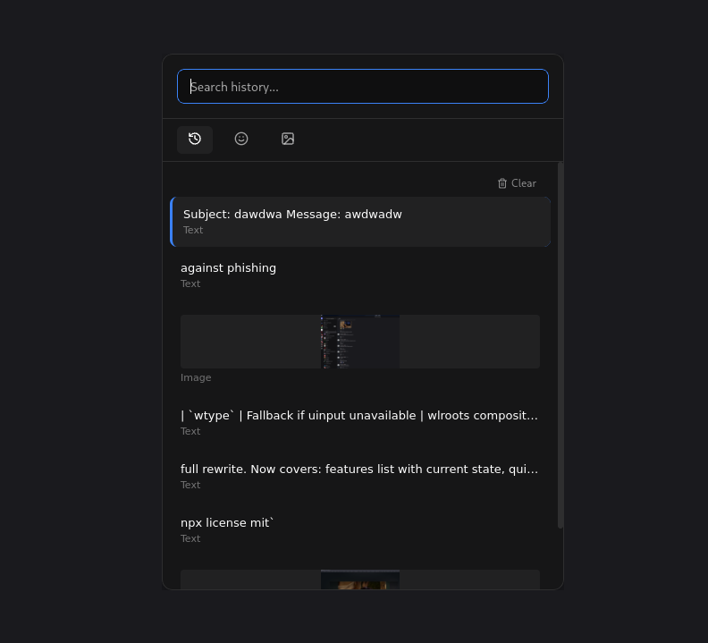
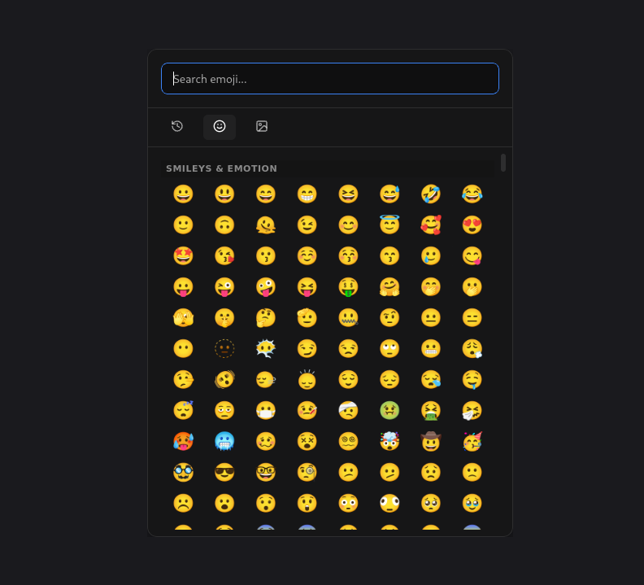
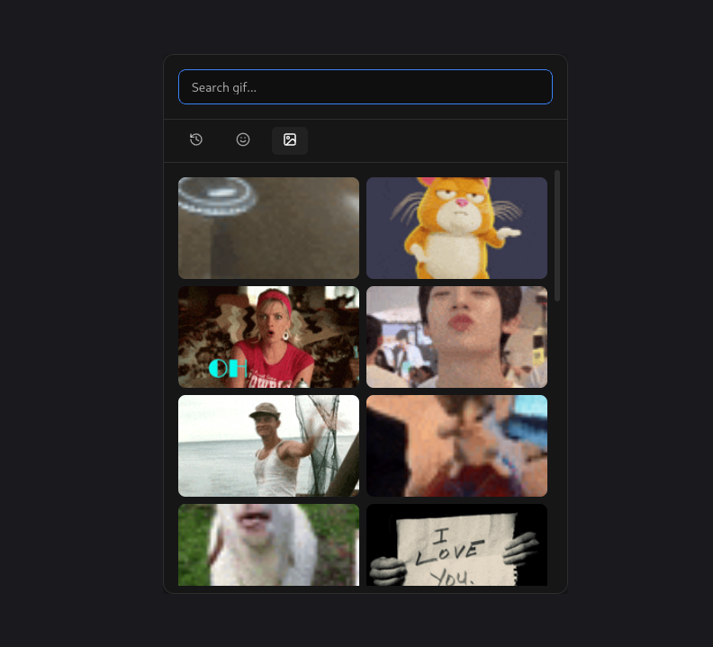

# Poplet

A modern clipboard manager for Linux (GNOME / Wayland). Press **Super+V** to open a popup with clipboard history, an emoji picker, and a GIF browser. Selecting any item copies it to your clipboard and pastes it directly into the focused app.

Built with [Tauri 2](https://tauri.app), React, and Rust.

<p align="center"></p>
<p align="center"><em>Clipboard history — text and image entries</em></p>

<p align="center"></p>
<p align="center"><em>Emoji picker — full Unicode set, grouped by category</em></p>

<p align="center"></p>
<p align="center"><em>GIF browser — Giphy-powered with infinite scroll</em></p>

## Features

- **Clipboard history** — text and images, persisted across sessions in SQLite
- **Image support** — copy a screenshot, see it as a thumbnail in history, click to paste
- **Emoji picker** — full Unicode emoji set, grouped by category, search by name
- **GIF browser** — Giphy-powered, infinite scroll, search and trending
- **Universal paste injection** — works in native Wayland apps (Zed, Firefox, GNOME Text Editor) *and* XWayland apps (Discord, Electron). Uses `/dev/uinput` so the compositor can't reject it
- **Keyboard navigation** — arrow keys, Enter, Tab between tabs
- **Lives in the system tray** — single resident process, hides on focus loss
- **Single instance via Unix socket** — pressing Super+V many times only ever talks to the running process

## Requirements

- Debian / Ubuntu (or compatible) with **GNOME on Wayland**
- [Rust](https://rustup.rs/) + Cargo
- Node.js 18+ and npm
- System packages installed automatically by `setup-poplet.sh`:
  - `xdotool`, `wtype` (paste fallbacks)
  - `fonts-noto-color-emoji` (so emojis render in color, not as text)

## Install

### From a prebuilt release (no Rust/Node toolchain needed)

> ⚠️ **The GIF tab does not work in prebuilt releases.**
> The GIF browser uses Giphy's API and needs a free API key, which can't be safely embedded in a public binary. Clipboard history and the emoji picker work normally — only the GIF tab is affected, and it shows a clear error pointing here. **If you need GIFs, [build from source](#from-source)** after putting your own key in `.env`.

Both `.deb` (Debian/Ubuntu) and `.AppImage` (any modern Linux) are attached to every release on the [Releases page](https://github.com/raid-teyar/poplet/releases/latest).

**`.deb`:**

```bash
sudo dpkg -i Poplet_*_amd64.deb
sudo apt-get install -f          # pulls any missing system deps
```

**`.AppImage`:**

```bash
chmod +x Poplet_*_amd64.AppImage
./Poplet_*_amd64.AppImage        # runs directly, no install
```

Then run the one-time system setup (registers Super+V, uinput perms, autostart):

```bash
git clone https://github.com/raid-teyar/poplet.git
cd poplet
bash setup-poplet.sh
```

### From source

```bash
git clone https://github.com/raid-teyar/poplet.git
cd poplet

# Provide a Giphy API key (free, takes ~2 minutes)
# https://developers.giphy.com/dashboard
cp .env.example .env
$EDITOR .env

# Build the production binary
npm install
npm run tauri build

# One-time system setup: udev rule, Super+V shortcut, autostart
bash setup-poplet.sh
```

If `setup-poplet.sh` adds you to the `input` group, it'll tell you to reboot. After rebooting, re-run the script and it'll skip what's already done and start Poplet.

That's it. Press **Super+V** from any app.

## Configuration

### Giphy API key (required for GIF tab)

The GIF tab uses Giphy's API. Tenor stopped accepting new API clients in January 2026, so Giphy is the practical option. Set `VITE_GIPHY_API_KEY` in `.env` before building. Without a key, the GIF tab shows a friendly error linking you to where to get one.

### Custom shortcut

`setup-poplet.sh` registers `<Super>v`. To change it, edit:

```
/org/gnome/settings-daemon/plugins/media-keys/custom-keybindings/poplet/binding
```

via `dconf-editor` or `gsettings`.

## How paste injection works

| Method | When used | Apps it reaches |
|--------|-----------|------------------|
| `/dev/uinput` (kernel-level evdev) | Primary, always tried first | All apps: native Wayland + XWayland |
| `wtype` | Fallback when uinput unavailable | wlroots compositors (not GNOME) |
| `xdotool` | Last fallback | XWayland apps only (Discord, Electron) |

Poplet works in **all** apps (native Wayland and XWayland) because it injects keystrokes through `/dev/uinput` at the kernel level, bypassing compositor restrictions entirely. `wtype` and `xdotool` are kept as fallbacks only in case `/dev/uinput` isn't available. The trade-off: the user must be in the `input` group (`setup-poplet.sh` handles this).

## Architecture

```
┌──────────────────────────────────────────────────────────────┐
│ React UI (src/)                                              │
│   App.tsx               history list, search, tab routing    │
│   components/           EmojiPicker, GifPicker               │
└────────────┬─────────────────────────────────────────────────┘
             │ tauri::invoke / event listen
┌────────────▼─────────────────────────────────────────────────┐
│ Rust core (src-tauri/src/lib.rs)                             │
│   - Clipboard polling thread (text + image, SHA-256 dedup)   │
│   - perform_paste command                                    │
│   - set_clipboard_image, clear_image_cache commands          │
│   - UnixListener on $XDG_RUNTIME_DIR/poplet.sock for         │
│     `poplet --toggle` to ask the running primary to toggle   │
│   - Tray icon, hide-on-blur                                  │
└──────────────────────────────────────────────────────────────┘
```

### Single-instance via Unix socket

The GNOME shortcut runs `poplet --toggle`. The new process tries to connect to `$XDG_RUNTIME_DIR/poplet.sock`; if it succeeds it sends `"toggle\n"` to the running primary and exits before Tauri/WebKit even loads. That's what prevents `gsd-media-keys` from spawning a fresh ~300 MB process on every keypress.

### Image storage

Clipboard images are deduplicated by SHA-256 of `(width, height, RGBA bytes)` and stored as PNGs at `$XDG_DATA_HOME/com.poplet.app/images/<hash>.png`. The history table keeps only the path; selecting an image row reads the file, sets it as the system clipboard, then pastes. Clearing history wipes both the rows and the cached PNGs.

## Project structure

```
.
├── src/                       React frontend
│   ├── App.tsx                Main app — history, tabs, keyboard nav, clear
│   └── components/
│       ├── EmojiPicker.tsx    Emoji tab, fed by `unicode-emoji-json`
│       └── GifPicker.tsx      Giphy-backed GIF tab with infinite scroll
├── src-tauri/
│   ├── src/lib.rs             Rust backend — clipboard monitor, paste,
│   │                          tray, socket-based single-instance
│   ├── Cargo.toml             Rust dependencies
│   ├── tauri.conf.json        Window config, asset-protocol scope, bundle
│   └── capabilities/          Tauri permission grants
├── setup-poplet.sh            One-time system setup
├── .env.example               Copy to .env, fill in Giphy key
└── package.json               Frontend dependencies + scripts
```

## Development

```bash
# Hot-reload UI; Rust auto-rebuilds on save
sg input -c "npm run tauri dev"
```

The `sg input -c` activates the `input` group for that shell so paste injection works without a reboot. If you've already rebooted since being added to `input`, you can drop the `sg input -c` wrapper.

### Build commands

| Command | What it does | When to use |
|---------|-------------|-------------|
| `npm run tauri dev` | Vite + cargo run, hot reload | Day-to-day development |
| `npm run build:fast` | Production binary, no `.deb` packaging | Iterating on production builds |
| `npm run tauri build` | Production binary + `.deb` | When you want a redistributable |

## Autostart

Poplet uses a systemd **user** service rather than a `.desktop` autostart entry — the `.desktop` approach raced GDM/Wayland startup and could prevent login from completing.

```bash
systemctl --user status poplet      # check status
systemctl --user stop poplet        # stop
systemctl --user disable poplet     # disable autostart
systemctl --user enable poplet      # re-enable autostart
```

## Troubleshooting

### `[poplet] virtual keyboard error: Permission denied`

You're not in the `input` group, or the udev rule for `/dev/uinput` isn't applied. Fix:

```bash
sudo usermod -aG input "$USER"
sudo chmod 660 /dev/uinput && sudo chgrp input /dev/uinput
# log out and back in
```

### `[poplet] virtual keyboard error: ... is uinput module loaded?`

```bash
sudo modprobe uinput
echo uinput | sudo tee /etc/modules-load.d/uinput.conf
```

### Emojis still render as black-and-white

Color emoji font isn't installed. `setup-poplet.sh` should have done this; otherwise:

```bash
sudo apt-get install fonts-noto-color-emoji
fc-cache -f
```

### Super+V doesn't open Poplet

Check the service is running:

```bash
systemctl --user status poplet
pgrep -af poplet
```

Verify the GNOME shortcut points at the right binary:

```bash
gsettings get org.gnome.settings-daemon.plugins.media-keys.custom-keybinding:/org/gnome/settings-daemon/plugins/media-keys/custom-keybindings/poplet/ command
```

## Contributing

PRs welcome. Areas that would help:

- KDE / Sway / wlroots compositor support (currently optimised for GNOME)
- Image clipboard on X11 (semantics differ from Wayland)
- Caching of Giphy responses (right now we hit the API on every search)
- Pinned/favourite clipboard items
- Configurable history limit / TTL

## License

[MIT](LICENSE)
